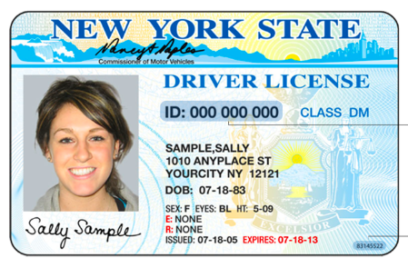

# My Identity Verification Service

[](https://travis-ci.com/s2t2/my-idv)

A proof of concept Identity Verification (IDV) Service. Reads the text from a user's driver's license, and compares the face in the driver's license to a selfie provided by the user.

## Setup

### Installation

Install from source:

```sh
git clone git@github.com:s2t2/my-idv.git
cd my-idv/
```

### Creds

Obtain [Google API credentials](https://console.cloud.google.com/apis/credentials) for a project with access to the Google Cloud Vision API. Store the credentials in this repo as "auth/credentials.json".


Obtain [Amazon API credentials](https://console.aws.amazon.com/iam/home?#/users) for an IAM user associated with an IAM group that has access to the `AmazonRekognitionFullAccess` permission. And store the resulting values in a local configuration file:

```sh
# ~/.aws/credentials
[default]
aws_access_key_id = YOUR_ACCESS_KEY
aws_secret_access_key = YOUR_SECRET_KEY
```

### Env

Setup a virtual environment:

```sh
conda create -n idv-env python=3.7 # (first time only)
conda activate idv-env
```

### Packages

Install Python package dependencies:

```sh
pip install -r requirements.txt # (first time only)
```

## Usage

### Parsing a Driver's License

Recognize text from a driver's license photo (see "img" directory):

```sh
python app/vision_service.py
```

Example driver's license photo:



Example output:

    NEW YORK STATE
    Commission
    of Motor Vehicles
    DRIVER LICENSE
    ID: 000 000 000
    CLASS DM
    SAMPLE,SALLY
    1010 ANYPLACE ST
    YOURCITY NY 12121
    DOB: 07-18-83
    SEX: F EYES: BL HT: 5-09
    E: NONE
    R: NONE
    ISSUED: 07-18-05 EXPIRES: 07-18-13
    Sety Somple
    CELSIOR
    83145522

### Comparing Faces

Compare faces from two images, ideally a selfie and a driver's license you've stored in the "img" directory:

```sh
python app/compare_faces.py
# ... OR... using specific images:
IMG1="my-selfie.jpg" IMG2="my-license.jpg" python app/compare_faces.py
```

Example output:

```sh
#> FACE MATCH (99.76588439941406% CONFIDENCE)
```

## Testing

Install the `pytest` package:

```sh
pip install pytest # (first time only)
```

Run automated tests:

```sh
pytest
```
